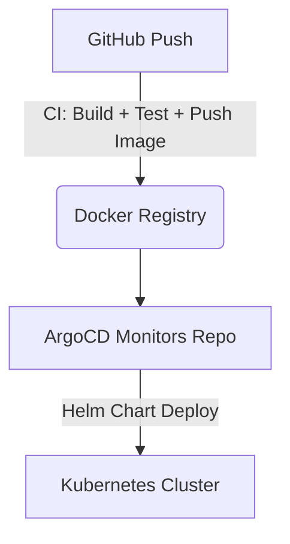

## DevOps Learning Project: FastAPI + Helm + GitHub Actions + ArgoCD

This is a hands-on DevOps learning project designed to help you build, containerize, and deploy a modern Python web application using a full CI/CD pipeline and GitOps workflows.

Anyone can fork this repo and use it as a practical learning experience.

---

## What You'll Build

You will create a simple **Task Manager API** using [FastAPI](https://fastapi.tiangolo.com/), then containerize, deploy, and manage it with:

- **Docker** for containerization  
- **Helm** for Kubernetes packaging  
- **GitHub Actions** for CI/CD  
- **ArgoCD** for GitOps-based deployment  
- **Kubernetes** (remote cluster) as the hosting platform  
- **PostgreSQL** as the backend database  

---

## Project Goals

By completing this project, you'll gain real-world experience in:

- Building a production-ready Python app
- Creating a Helm chart to package your app for Kubernetes
- Writing a GitHub Actions pipeline for testing, building, and deploying
- Using ArgoCD to manage automated deployments via Git

---

## Tech Stack

| Component     | Tool/Service             |
|---------------|---------------------------|
| API Framework | FastAPI                   |
| Database      | PostgreSQL                |
| CI/CD         | GitHub Actions            |
| Packaging     | Docker, Helm              |
| Deployment    | Kubernetes (cloud)        |
| GitOps        | ArgoCD                    |

---

##  How to Use This Repository

### 1. Fork the Repository

Click the **"Fork"** button at the top-right to create your own copy.

Then clone your fork:

```bash
git clone https://github.com/<your-username>/fastapi-devops-project.git
cd fastapi-devops-project
````

---

### 2. Build the FastAPI App

* Add CRUD endpoints to manage tasks
* Use SQLAlchemy + Alembic for database integration
* Use PostgreSQL as the backend
* Add unit tests with `pytest`

---

### 3. Dockerize the App

* Write a `Dockerfile`
* Build and run locally with Docker
* Push to DockerHub or GitHub Container Registry

---

### 4. Create a Helm Chart

In `helm/task-manager/`, create templates for:

* `deployment.yaml`
* `service.yaml`
* `ingress.yaml`

Use `values.yaml` for config like image tag and replica count.

---

### 5. Set Up GitHub Actions

Create a CI/CD workflow in `.github/workflows/ci.yml` to:

* Run tests
* Build and push the Docker image
* (Optional) Update Helm values with the new image tag

---

### 6.Deploy with ArgoCD

* Install ArgoCD on your remote Kubernetes cluster
* Create an ArgoCD application pointing to your GitHub repo
* Path: `helm/task-manager/`
* Enable **auto-sync** so changes to Git trigger new deployments

---

## Workflow Summary



---

## Completion Criteria

* App is functional and tested locally
* Docker image builds and pushes successfully
* Helm chart deploys app correctly
* CI/CD pipeline runs on every push
* ArgoCD auto-deploys changes from GitHub
* PRs are used for collaboration (if working in teams)
